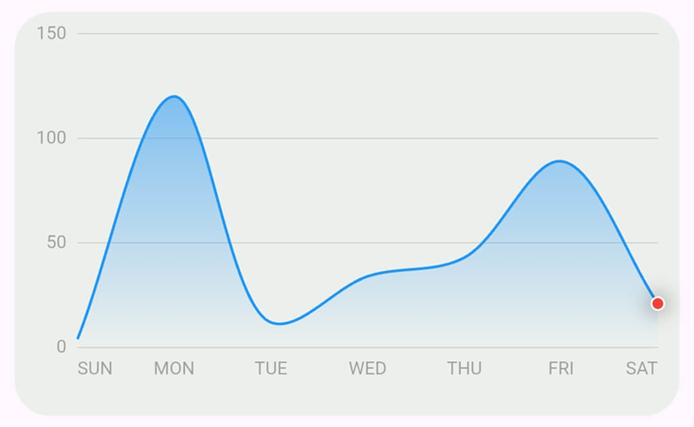
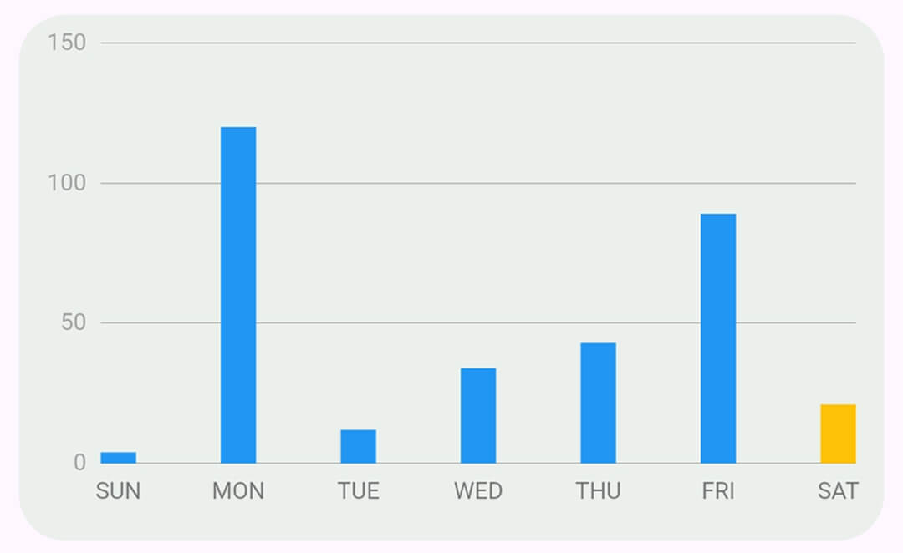

<!--
This README describes the package. If you publish this package to pub.dev,
this README's contents appear on the landing page for your package.

For information about how to write a good package README, see the guide for
[writing package pages](https://dart.dev/tools/pub/writing-package-pages).

For general information about developing packages, see the Dart guide for
[creating packages](https://dart.dev/guides/libraries/create-packages)
and the Flutter guide for
[developing packages and plugins](https://flutter.dev/to/develop-packages).
-->

# Simple Chart

A simple package for adding Line and Bar charts to you projects hassle free.

## Preview




## Simple Use

1. Import `simple_chart.dart`

```dart
import "package:simple_chart/simple_chart.dart";
```

2. Add widget

```dart
LineChart(
    values: [20, 34, 2, -12, 43],
    labels: ['MON', 'TUE', 'WED', 'THU', 'FRI'], // length of values and labels must be the same
    onTap(index){} // index represents which data point was clicked or selected
),
```

```dart
BarChart(
    values: [20, 34, 2, -12, 43],
    labels: ['MON', 'TUE', 'WED', 'THU', 'FRI'], // length of values and labels must be the same
    onTap(index){} // index represents which data point was clicked or selected
),
```

## Advanced Use

Here's a preview of all the fields you can customize.

```dart
  LineChart({
    super.key,
    this.yLabelSpacing = 6,
    this.xLabelSpacing = 6,
    this.xLabelHeight = 10,
    this.graphPadding = .zero,
    this.xLabelAlignment = XLabelAlignment.showAllWithFirstAndLastInLine,
    required this.values,
    required this.labels,
    this.onTap,
    this.unit = "",
    this.unitAlignment = UnitAlignment.right,
    this.yAxisLineCount = 6,
    this.height = 200,
    this.width = .infinity,
    this.hLinesColor = Colors.grey,
    this.vLinesColor = Colors.green,
    this.zeroLineColor = Colors.red,
    this.yLabelColor = Colors.grey,
    this.xLabelColor = Colors.grey,
    this.fillGradient = const [Color(0xAC2195F3), Color(0x002195F3)],
    this.lineColor = Colors.blue,
    this.dotColor = Colors.red,
    this.dashesColor = Colors.grey,
    this.useCurvedLines = true,
    this.lineWidth = 1.5,
    this.hLineWidth = .08,
    this.yLabelStyle = const TextStyle(),
    this.xLabelStyle = const TextStyle(),
  });

```

```dart
 BarChart({
    super.key,
    this.yLabelSpacing = 6,
    this.xLabelSpacing = 6,
    this.xLabelHeight = 15,
    this.graphPadding = .zero,
    this.xLabelAlignment = XLabelAlignment.showAllCentered,
    required this.values,
    required this.labels,
    this.onTap,
    this.unit = "",
    this.unitAlignment = UnitAlignment.right,
    this.yAxisLineCount = 6,
    this.height = 200,
    this.width = .infinity,
    this.hLinesColor = Colors.grey,
    this.vLinesColor = Colors.green,
    this.zeroLineColor = Colors.red,
    this.yLabelStyle = const TextStyle(),
    this.xLabelStyle = const TextStyle(),
    this.barColor = Colors.blue,
    this.negativeBarColor = Colors.red,
    this.selectedBarColor = Colors.amber,
  });
```

#### Don't forget to leave a 👍 and feel free to contribute.
